<div align="center">
    
    <h1>LinkVault - URL Shortener</h1>
</div>

Welcome to **LinkVault**, a high-performance URL shortening service built with .NET 10 and Blazor!

LinkVault is a full-stack web application that transforms long URLs into concise, shareable links with advanced features like analytics, QR codes, link expiration, and custom aliases. Designed with scalability, security, and developer experience in mind.

## Table of Contents <!-- omit in toc -->

- [Overview](#overview)
- [Requirements](#requirements)
- [Why This Project?](#why-this-project)
- [Features](#features)
- [Challenges](#challenges)
- [Technologies](#technologies)
- [Project Architecture](#project-architecture)
  - [Layer Structure](#layer-structure)
  - [System Architecture](#system-architecture)
- [Database Schema](#database-schema)
  - [Core Entities](#core-entities)
  - [ER Diagram](#er-diagram)
- [Azure Functions](#azure-functions)
  - [Link Expiration Function](#link-expiration-function)
  - [Click Analytics Aggregation Function](#click-analytics-aggregation-function)
- [External API Integration](#external-api-integration)
  - [QR Code Generation API](#qr-code-generation-api)
  - [Link Preview / Metadata API](#link-preview--metadata-api)
- [Authentication Strategy](#authentication-strategy)
- [Load Balancing Strategy](#load-balancing-strategy)
- [Rate Limiting Strategy](#rate-limiting-strategy)
- [Caching Strategy](#caching-striting)
- [Unique ID Generation](#unique-id-generation)
- [Encoding Strategy](#encoding-strategy)
- [Getting Started](#getting-started)
  - [Prerequisites](#prerequisites)
  - [Running the Application](#running-the-application)
- [Future Enhancements](#future-enhancements)
- [Version](#version)
- [Contributing](#contributing)
- [License](#license)
- [Contact](#contact)

## Overview

LinkVault transforms long, unwieldy URLs into short, memorable links with a suite of powerful features. Built with modern .NET 10, Blazor, and Azure services, it delivers a production-grade experience suitable for enterprise deployment.

### Why This Project?

URL shorteners are deceptively complex systems. Behind a simple redirect lies interesting engineering challenges:

- **High-performance redirects** -- Sub-millisecond response times at scale
- **Distributed caching** -- Redis-backed caching for instant lookups
- **Unique ID generation** -- Globally unique, sortable identifiers
- **Base62 encoding** -- Efficient URL-safe encoding of numeric IDs
- **Load balancing** -- Geographically distributed traffic routing
- **Rate limiting** -- Protecting the service from abuse
- **Analytics** -- Click tracking with detailed metrics
- **QR codes** -- Bridging physical and digital worlds

This project demonstrates mastery of these concepts while delivering a genuinely useful tool.

## Features

### Core Features

- **URL Shortening** -- Convert long URLs to short, shareable links
- **Custom Aliases** -- Create memorable custom slugs (e.g., `linkvault.io/github`)
- **Link Expiration** -- Set expiration dates or click limits on links
- **QR Code Generation** -- Generate QR codes for any shortened link
- **Link Preview** -- View metadata (title, description, image) before redirecting

### Analytics & Tracking

- **Click Analytics** -- Track clicks with timestamp, geography, device, and referrer
- **Dashboard** -- Visual analytics showing link performance over time
- **Link Management** -- View, edit, and delete all your shortened links

### Security & Performance

- **Rate Limiting** -- Protect against abuse with per-IP and per-user limits
- **Link Scanning** -- External API integration for malicious URL detection
- **Caching** -- Redis-backed caching for sub-millisecond redirect performance
- **Load Balancing** -- Azure Front Door for global traffic distribution

### User Management

- **Authentication** -- Secure user registration and login
- **External Providers** -- GitHub OAuth integration
- **User Dashboard** -- Personal link management centre

## Technologies

| Component | Technology | Justification |
|---|---|---|
| **Frontend** | Blazor Server | Native .NET ecosystem integration, real-time capabilities, excellent for dashboard/analytics UIs. Seamless integration with ASP.NET Identity and external auth templates. |
| **Backend** | ASP.NET Core 10 Minimal APIs | Modern .NET 10 with route groups, endpoint filters, and TypedResults for clean, fast API endpoints. |
| **Database** | SQL Server (Azure SQL) | Enterprise-grade relational database with geo-replication for global performance. |
| **ORM** | Entity Framework Core | Mature, well-documented ORM with migrations support and Azure SQL integration. |
| **Caching** | Redis (Azure Cache for Redis) | Sub-millisecond lookups for redirect performance. Cache-aside pattern with TTL management. |
| **Load Balancer** | Azure Front Door | Global traffic distribution with geographic routing, SSL termination, and WAF integration. |
| **Rate Limiting** | ASP.NET Core Rate Limiting | Built-in middleware with sliding window, fixed window, and concurrency limiters. |
| **Authentication** | ASP.NET Identity + GitHub OAuth | Industry-standard identity with external provider support. GitHub is natural for developer audience. |
| **Functions** | Azure Functions (isolated worker) | Serverless compute for background tasks (expiration, analytics) with .NET 10 isolated model. |
| **Monitoring** | Application Insights + Serilog | Full observability with traces, metrics, logs, and live metrics stream. |
| **External API** | QR Code API / Link Preview API | External APIs for QR generation and metadata extraction. |
| **Deployment** | Azure App Service + Azure Functions + Azure SQL + Azure Cache for Redis | First-class .NET support with managed services and integrated monitoring. |

## Project Architecture

### Layer Structure

```
LinkVault/
├── LinkVault.AppHost/              # .NET Aspire orchestration
├── LinkVault.BlazorApp/            # Blazor Server frontend
├── LinkVault.Api/                  # ASP.NET Core Minimal API backend
├── LinkVault.Application/          # Business logic, services, DTOs
├── LinkVault.Domain/               # Domain entities, enums, value objects
├── LinkVault.Infrastructure/       # EF Core, Redis, external API clients
├── LinkVault.Common/               # Shared utilities, constants
├── LinkVault.Functions/            # Azure Functions (link expiration, analytics)
├── LinkVault.Tests.Unit/           # Unit tests (xUnit + FluentAssertions)
└── LinkVault.Tests.Integration/    # Integration tests (WebApplicationFactory)
```

- **LinkVault.BlazorApp** -- Web front-end built with Blazor Server. Handles UI, forms, and dashboard.
- **LinkVault.Api** -- REST API built with Minimal APIs. Handles URL shortening, redirects, and analytics.
- **LinkVault.Application** -- Business logic layer containing services, DTOs, and interfaces.
- **LinkVault.Domain** -- Domain entities (Link, ClickEvent, User), enums (LinkStatus), value objects.
- **LinkVault.Infrastructure** -- EF Core DbContext, repository implementations, Redis cache, external API clients.
- **LinkVault.Functions** -- Azure Functions for background processing (expiration, analytics aggregation).
- **LinkVault.Tests.Unit** -- Unit tests for services and business logic.
- **LinkVault.Tests.Integration** -- Integration tests for API endpoints and database interactions.

### System Architecture

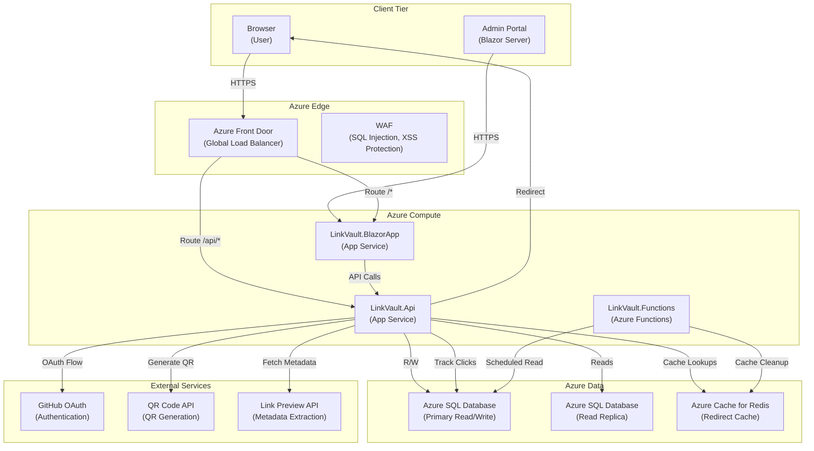

### Container Diagram

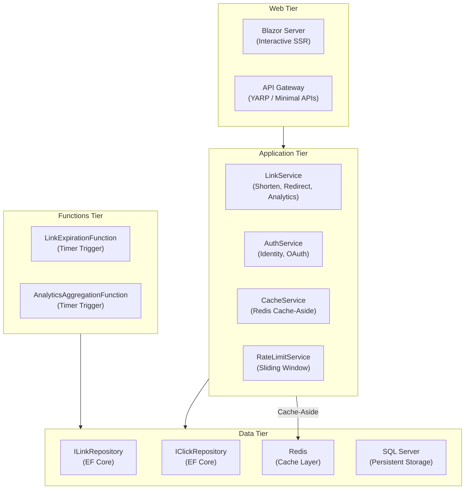

## Database Schema

### Core Entities

The database contains the following main tables:

#### Links

Stores shortened URL records with metadata and expiration settings.

| Column | Type | Constraints | Description |
|---|---|---|---|
| Id | `uniqueidentifier` | PK | Primary key |
| Code | `nvarchar(20)` | UNIQUE, INDEX | Base62-encoded unique identifier |
| OriginalUrl | `nvarchar(4000)` | NOT NULL | The original long URL |
| Title | `nvarchar(500)` | NULL | Optional title/description |
| IsCustom | `bit` | NOT NULL, DEFAULT 0 | Whether alias is custom |
| ExpiresAt | `datetimeoffset` | NULL | Optional expiration date |
| MaxClicks | `int` | NULL | Optional click limit |
| ClickCount | `int` | NOT NULL, DEFAULT 0 | Current click count |
| Status | `int` | NOT NULL | LinkStatus enum (Active=0, Expired=1, Disabled=2) |
| CreatedAt | `datetimeoffset` | NOT NULL | Creation timestamp |
| CreatedByUserId | `uniqueidentifier` | FK, NULL | Nullable for anonymous links |
| IsPublic | `bit` | NOT NULL, DEFAULT 1 | Whether link appears in public dashboards |

#### ClickEvents

Stores individual click events for analytics.

| Column | Type | Description |
|---|---|---|
| Id | `uniqueidentifier` | Primary key |
| LinkId | `uniqueidentifier` | FK to Links |
| ClickedAt | `datetimeoffset` | Timestamp of click |
| IpAddress | `nvarchar(45)` | IPv4/IPv6 address |
| UserAgent | `nvarchar(1000)` | Browser user agent |
| ReferrerUrl | `nvarchar(4000)` | HTTP referrer |
| Country | `nvarchar(100)` | GeoIP country |
| City | `nvarchar(100)` | GeoIP city |
| DeviceType | `nvarchar(20)` | Desktop/Mobile/Tablet/Bot |
| Browser | `nvarchar(50)` | Detected browser |
| Os | `nvarchar(50)` | Detected operating system |

#### Users (ASP.NET Identity)

Standard ASP.NET Identity tables for authentication.

- **AspNetUsers**: User identity data
- **AspNetRoles**: Role definitions
- **AspNetUserRoles**: User-role assignments
- **ExternalLogins**: Linked OAuth providers (GitHub, Google, etc.)

### ER Diagram

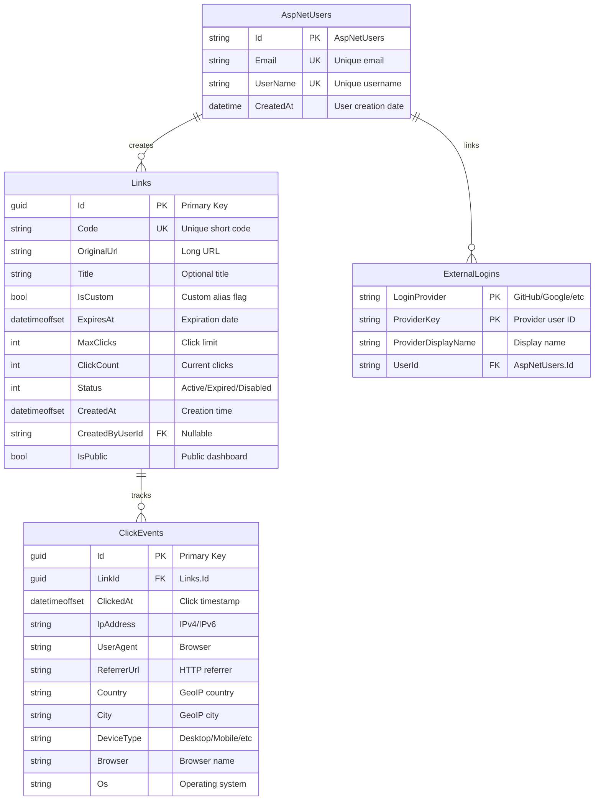

### Caching Strategy

The caching strategy uses a **cache-aside** pattern with Redis for sub-millisecond redirect performance.

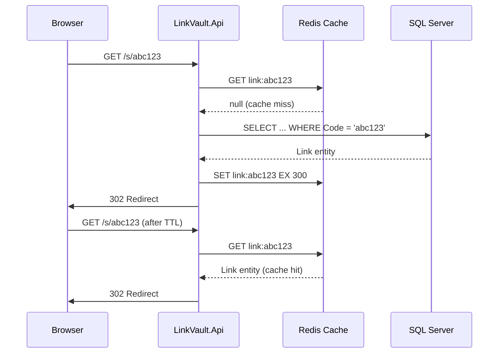

**Cache Keys:**
- `link:{code}` -- Link redirect data (TTL: 5 minutes)
- `link:stats:{id}` -- Aggregated statistics (TTL: 1 minute)
- `user:{id}:links` -- User's link list (TTL: 2 minutes)

**Cache Invalidation:**
- On link update/delete: DELETE relevant keys
- On click event: Increment counter in Redis (INCRBY), flush to DB periodically
- Scheduled cleanup via Azure Function

### Unique ID Generation

The system uses **ULID (Universally Unique Lexicographically Sortable Identifier)** for unique link codes, providing:

- **128-bit** uniqueness across distributed systems
- **Sortable** by creation time (useful for analytics)
- **Lexicographically sortable** for database indexing
- **K-Sortable** implementation for efficient database lookups

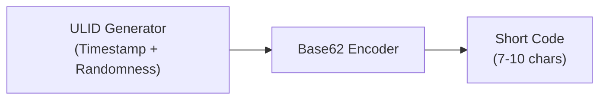

**Format:**
- Timestamp (48 bits): Unix time in milliseconds
- Randomness (80 bits): Cryptographically secure random bytes
- Total: 128 bits encoded as 20+ characters in Crockford Base32 → Compact Base62 output

**Custom Alias Handling:**
- Users can specify custom aliases (e.g., `github`, `my-project`)
- System validates uniqueness and reserved word blacklist
- Falls back to ULID-based code if custom code unavailable

### Encoding Strategy

Base62 encoding compresses numeric IDs into URL-safe alphanumeric strings.

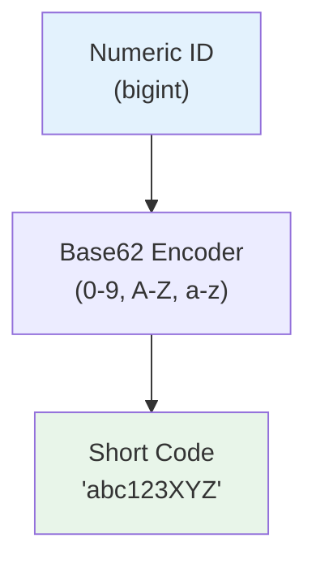

**Why Base62?**
- 62 characters: `0-9`, `A-Z`, `a-z`
- URL-safe (no special characters)
- Case-sensitive (26 + 26 + 10 = 62 unique characters)
- 7 characters = 62^7 ≈ 3.5 trillion unique codes

## Azure Functions

### Link Expiration Function

Removes expired links from the cache and marks them as expired in the database.

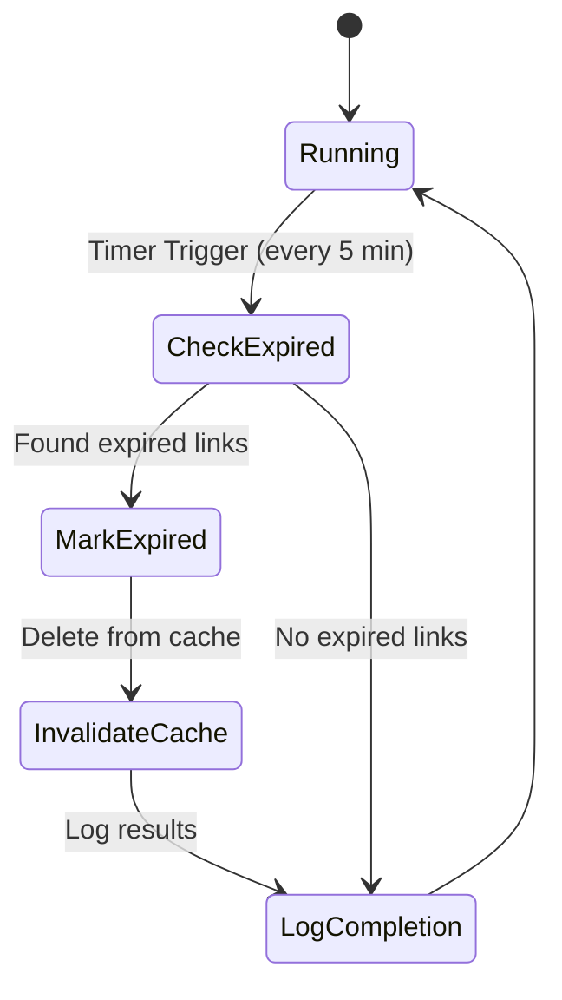

**Implementation:**
- **Trigger**: Timer (cron: `0 */5 * * * *` -- every 5 minutes)
- **Action**: Queries links where `ExpiresAt < NOW() AND Status = Active`
- **Result**: Updates status to `Expired` and removes from Redis cache

### Click Analytics Aggregation Function

Aggregates click events and updates denormalized statistics for fast dashboard queries.

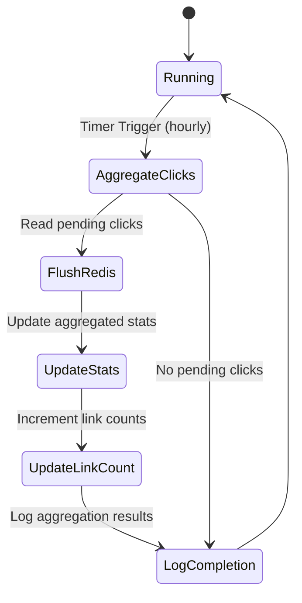

**Implementation:**
- **Trigger**: Timer (cron: `0 0 * * * *` -- every hour)
- **Action**: Reads click counters from Redis, flushes to SQL Server
- **Result**: Updated `ClickCount` on Links table, cleared Redis counters

## External API Integration

### QR Code Generation API

Generates QR codes for shortened links, bridging physical and digital worlds.

**Provider Options:**
- **QRServer API** (free, no API key): `https://api.qrserver.com/v1/create-qr-code/?size=300x300&data={encodedUrl}`
- **GoQR.me API** (free, no API key): `https://api.qrserver.com/v1/create-qr-code/?size=300x300&data={encodedUrl}`

**Implementation:**
```csharp
public async Task<byte[]> GenerateQrCodeAsync(string url)
{
    var encodedUrl = Uri.EscapeDataString(url);
    var apiUrl = $"https://api.qrserver.com/v1/create-qr-code/?size=300x300&data={encodedUrl}";

    var response = await _httpClient.GetAsync(apiUrl);
    response.EnsureSuccessStatusCode();

    return await response.Content.ReadAsByteArrayAsync();
}
```

**Usage:**
- Display QR code in link management dashboard
- Allow users to download QR code as PNG
- Embed QR code in shareable cards

### Link Preview / Metadata API

Fetches Open Graph and Twitter Card metadata for URL preview before redirect.

**Provider Options:**
- **LinkPreview API** (free tier, API key): `https://api.linkpreview.net/?key={key}&q={url}`
- **Microlink API** (free tier, API key): `https://api.microlink.io/?url={url}`
- **Custom Implementation**: Build our own metadata extraction service with Azure Functions

**Implementation (Custom Service):**
```csharp
public async Task<LinkMetadata> FetchMetadataAsync(string url)
{
    // Use AngleSharp or HtmlAgilityPack to parse HTML
    // Extract: og:title, og:description, og:image, twitter:card
    // Cache results in Redis for 24 hours
}
```

**Usage:**
- Display link preview cards in the dashboard
- Show preview before creating a link
- Generate social media share cards

## Authentication Strategy

### ASP.NET Identity with GitHub OAuth

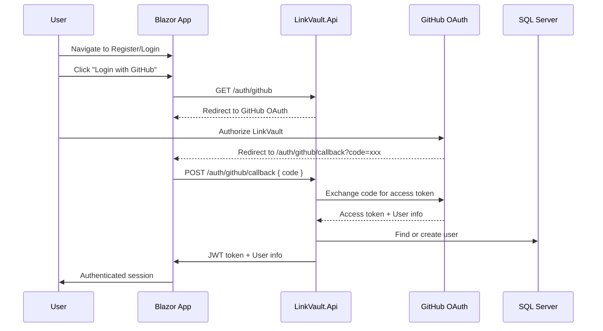

**Provider Configuration:**
- GitHub OAuth App (Client ID + Secret)

**Authorization Levels:**
- **Anonymous**: Can create short links (rate limited)
- **Authenticated**: Full dashboard, link management, analytics
- **Admin**: System-wide link management, ban users

## Load Balancing Strategy

Azure Front Door provides global traffic distribution with intelligent routing.

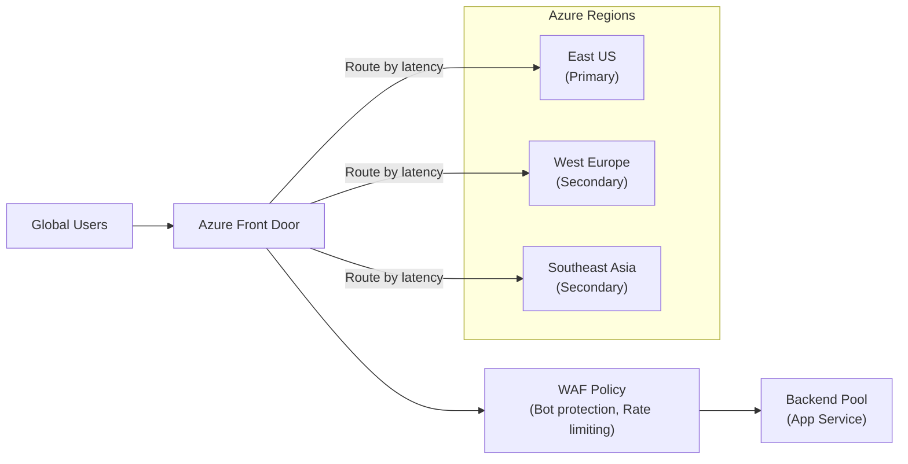

**Features:**
- **Geographic routing**: Users routed to nearest region
- **Health probes**: Automatic failover if a region becomes unhealthy
- **SSL termination**: Centralized HTTPS management
- **Web Application Firewall**: Protection against OWASP Top 10
- **CDN**: Static asset caching at edge nodes

## Rate Limiting Strategy

ASP.NET Core Rate Limiting middleware provides multi-layered protection.

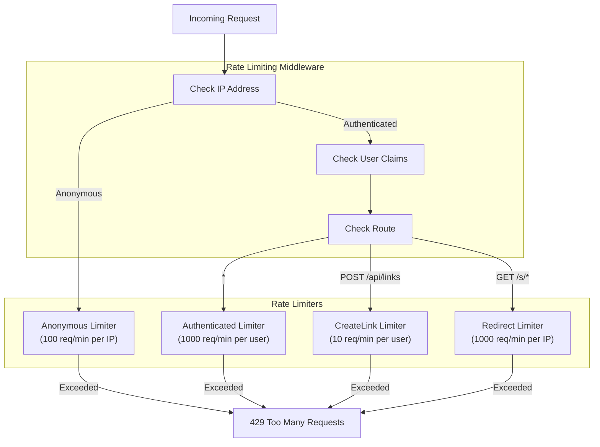

**Configuration:**
- **Sliding window** algorithm for smooth rate limiting
- **Per-IP** limits for anonymous users
- **Per-User** limits for authenticated users
- **Per-Endpoint** limits for expensive operations

## Getting Started

### Prerequisites

> [!IMPORTANT]
> These are required in order for the application to run.

- .NET 10 SDK
- An IDE (Visual Studio 2022 17.12+ or Visual Studio Code)
- Docker Desktop (for SQL Server container in local dev)
- Azure account (for deployment)
- GitHub OAuth App (for authentication)

### Running the Application

1. Clone the repository:
   ```bash
   git clone https://github.com/chrisjamiecarter/linkvault.git
   ```

2. Navigate to the solution directory:
   ```bash
   cd linkvault
   ```

3. Configure user secrets for local development:
   ```bash
   dotnet user-secrets init
   dotnet user-secrets set "ConnectionStrings:DefaultConnection" "Server=localhost;Database=LinkVault;User=sa;Password=YourPassword"
   dotnet user-secrets set "Redis:ConnectionString" "localhost:6379"
   dotnet user-secrets set "Authentication:GitHub:ClientId" "your-github-client-id"
   dotnet user-secrets set "Authentication:GitHub:ClientSecret" "your-github-client-secret"
   ```

4. Run the Aspire App Host:
   ```bash
   dotnet run --project ./src/LinkVault.AppHost
   ```

5. The Aspire dashboard will open. Wait for all resources to initialize, then navigate to the web app.

   > [!NOTE]
   > If the Aspire dashboard does not open automatically, find the link in the console output.

6. Register a new account or log in with GitHub OAuth.

## Version

This document applies to LinkVault v0.1.0 (initial planning).

## Contributing

Contributions are not welcome at this time!

## License

This project is licensed under the MIT License. See the [LICENSE](./LICENSE) file for details.

## Contact

For any questions or feedback, please open an issue.
