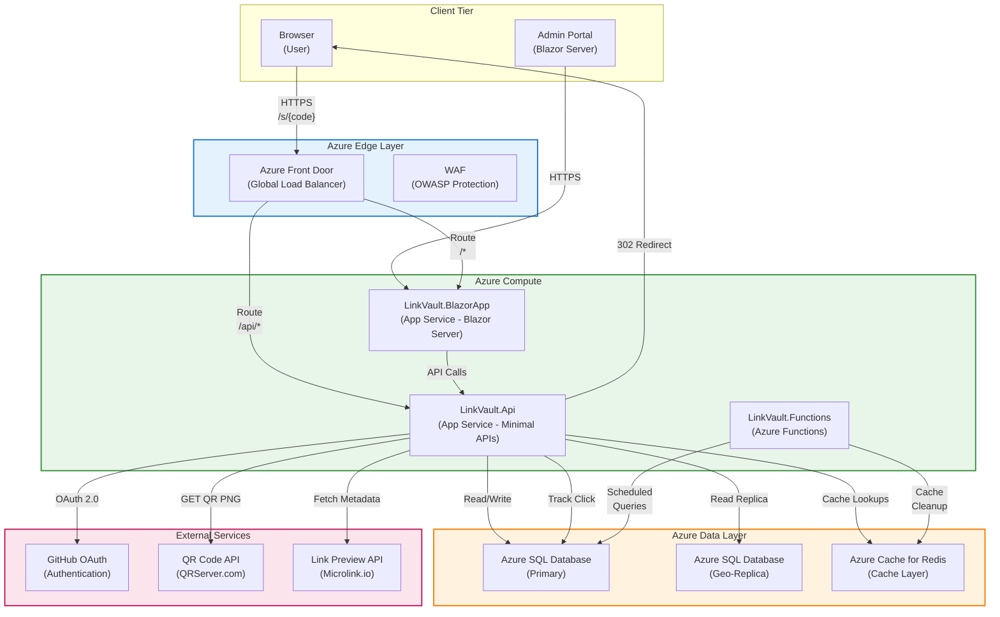
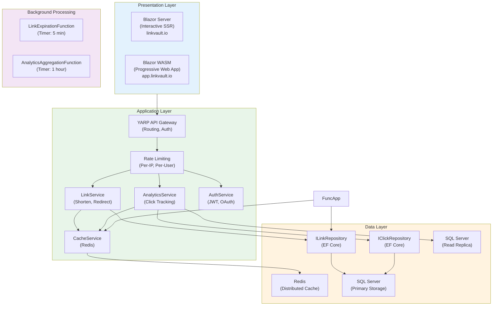
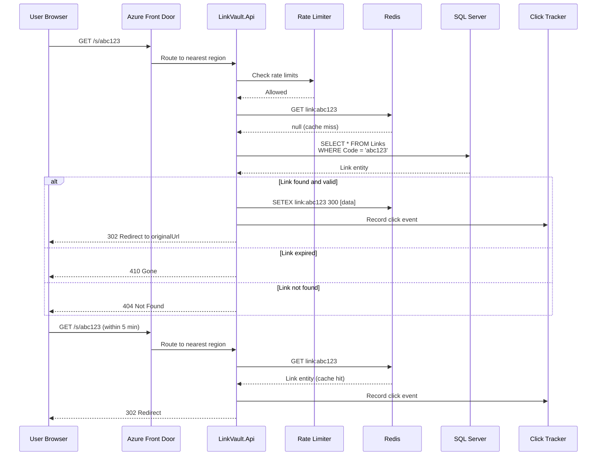
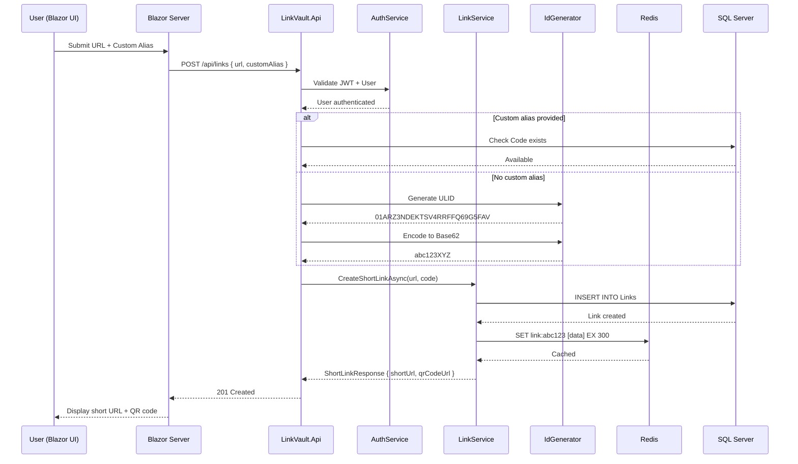
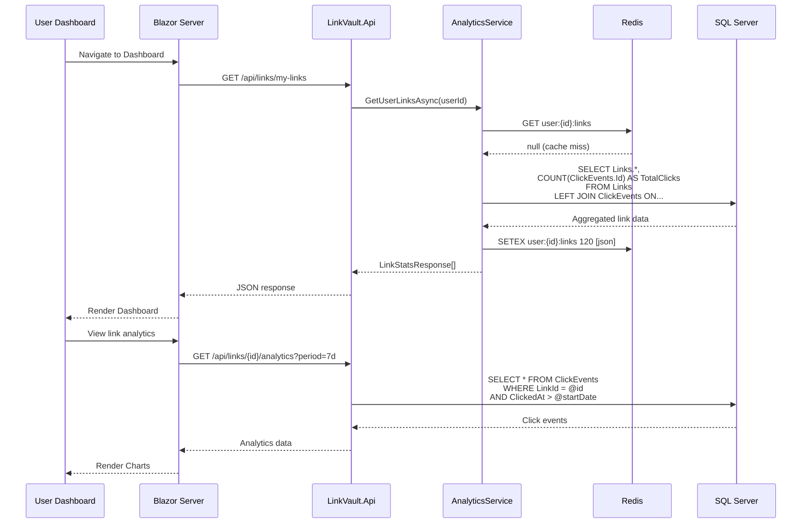
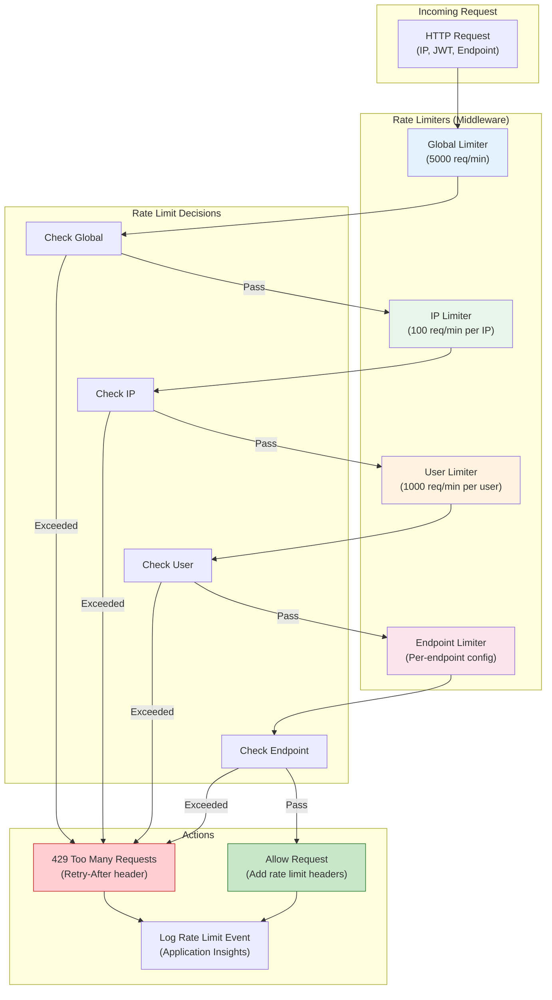
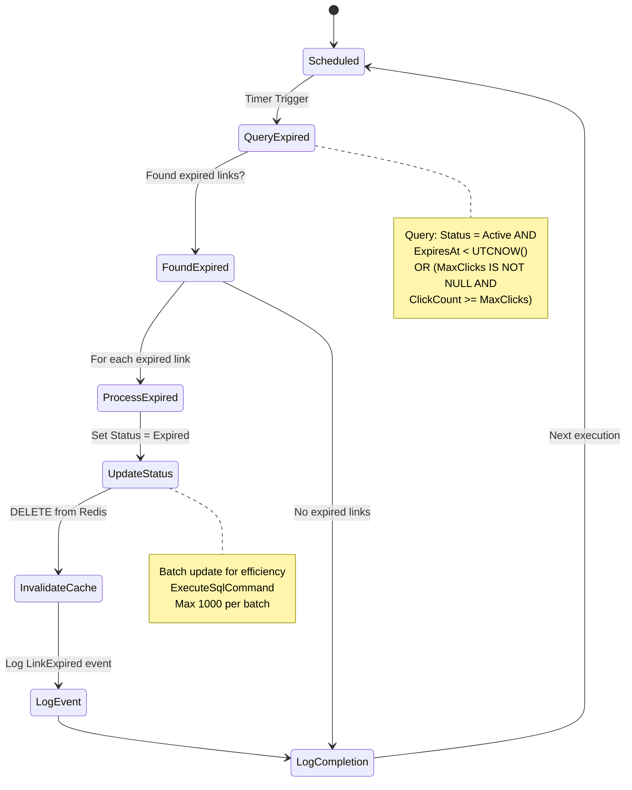
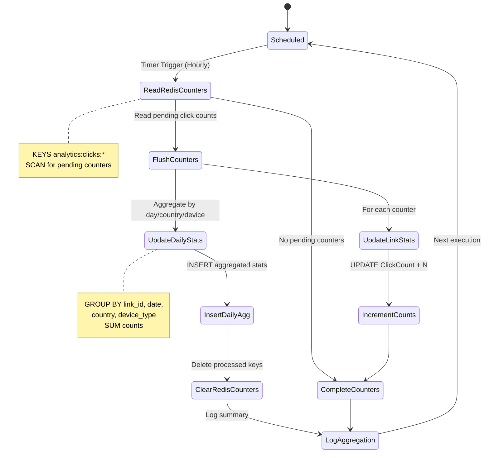
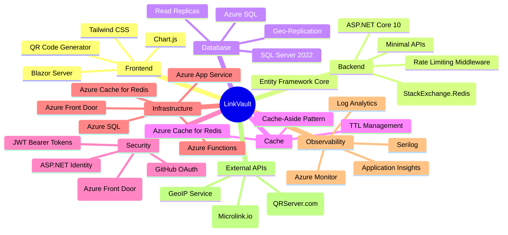

# LinkVault Architecture Diagrams

This document contains all Mermaid diagrams for the LinkVault URL Shortener project. These diagrams are designed to be rendered on GitHub (native Mermaid support) and in documentation platforms.

%%{init: {'theme': 'neutral'}}%%

## System Architecture



## Container Architecture



## Redirect Flow Sequence



## URL Shortening Flow



## Analytics Dashboard Flow



## Database Schema (ER Diagram)

```mermaid
erDiagram
    AspNetUsers ||--o{ Links : "creates"
    AspNetUsers {
        string Id PK "AspNetUsers"
        string Email UK "Unique email"
        string UserName UK "Unique username"
        string NormalizedEmail "Normalized"
        string NormalizedUserName "Normalized"
        string PasswordHash "Hashed password"
        datetimeoffset CreatedAt "Creation date"
        datetimeoffset LastLoginAt "Last login"
        bool IsActive "Account status"
    }

    Links ||--o{ ClickEvents : "tracks"
    Links ||--o| AspNetUsers : "belongs to"
    Links {
        guid Id PK "Primary Key"
        string Code UK "Unique short code (indexed)"
        string OriginalUrl "Long URL (required)"
        string Title "Optional title"
        string Description "Optional description"
        bool IsCustom "Custom alias flag"
        datetimeoffset ExpiresAt "Expiration (nullable)"
        int MaxClicks "Click limit (nullable)"
        int ClickCount "Current click count"
        int Status "0=Active, 1=Expired, 2=Disabled"
        datetimeoffset CreatedAt "Creation timestamp"
        string CreatedByUserId FK "Nullable, links to AspNetUsers"
        bool IsPublic "Public dashboard visibility"
        datetimeoffset? UpdatedAt "Last update time"
    }

    ClickEvents {
        guid Id PK "Primary Key"
        guid LinkId FK "Links.Id (indexed)"
        datetimeoffset ClickedAt "Click timestamp (indexed)"
        string IpAddress "IPv4/IPv6"
        string UserAgent "Browser string"
        string ReferrerUrl "HTTP referrer (nullable)"
        string Country "GeoIP country"
        string Region "GeoIP region/state"
        string City "GeoIP city"
        string DeviceType "Desktop/Mobile/Tablet/Bot"
        string BrowserName "Browser name"
        string BrowserVersion "Browser version"
        string OsName "OS name"
        string OsVersion "OS version"
        bool IsUnique "First click from this IP"
    }

    AspNetUsers ||--o{ ExternalLogins : "has linked"
    ExternalLogins {
        string LoginProvider PK "GitHub/Google/Microsoft"
        string ProviderKey PK "Provider user ID"
        string? DisplayName "Display name"
        string UserId FK "AspNetUsers.Id"
    }

    Links {
        INDEX idx_links_code ON Links(Code)
        INDEX idx_links_user ON Links(CreatedByUserId)
        INDEX idx_links_status ON Links(Status)
        INDEX idx_links_expires ON Links(ExpiresAt) WHERE Status = 0
    }

    ClickEvents {
        INDEX idx_clicks_link ON ClickEvents(LinkId)
        INDEX idx_clicks_time ON ClickEvents(ClickedAt)
        INDEX idx_clicks_geo ON ClickEvents(Country, City)
        INDEX idx_clicks_device ON ClickEvents(DeviceType)
    }
```

## Rate Limiting Architecture



## Azure Functions

### Link Expiration Function



### Click Analytics Aggregation Function



## Technology Stack Summary


